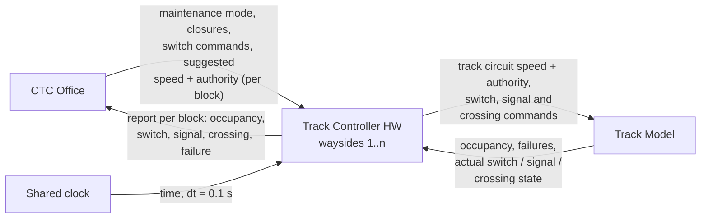
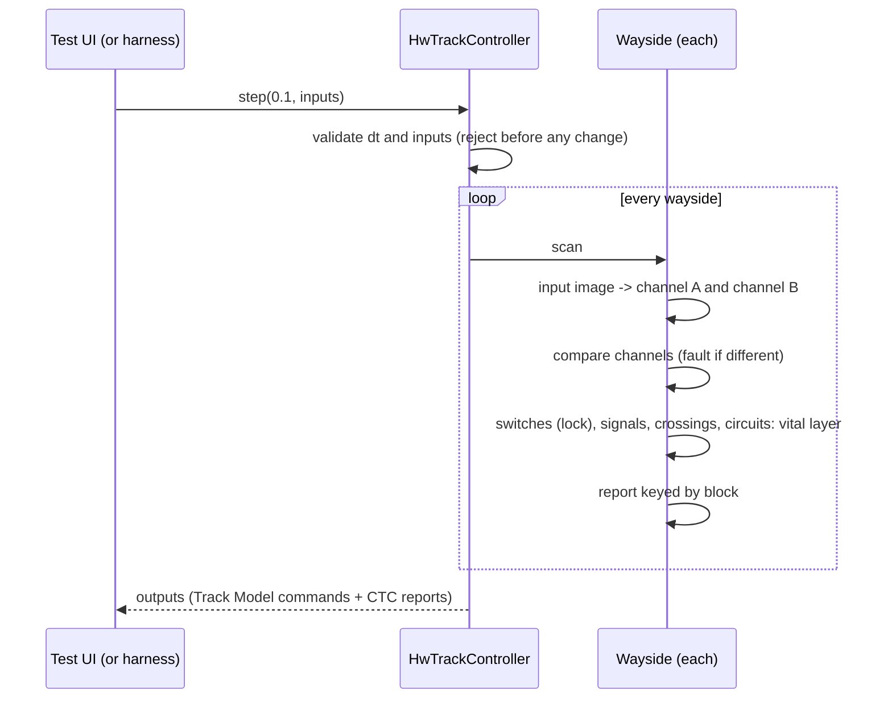

# Track Controller (hardware): presentation guide

Your crib sheet for presenting the module and answering questions about it.
Every expected result in the walkthrough was checked by running the module
on 2026-10-08. Anything not verified is marked **(unverified)** or
**(open)**.

Contents:

1. [The 30-second pitch](#1-the-30-second-pitch)
2. [Where the module sits](#2-where-the-module-sits)
3. [Starting it](#3-starting-it)
4. [Tour of the Track Controller window](#4-tour-of-the-track-controller-window)
5. [Tour of the test UI](#5-tour-of-the-test-ui)
6. [Demo walkthrough script](#6-demo-walkthrough-script)
7. [Switches and what "agreeing" means](#7-switches-and-what-agreeing-means)
8. [Signals](#8-signals)
9. [The PLC language](#9-the-plc-language)
10. [The three PLC programs](#10-the-three-plc-programs)
11. [The wayside database files](#11-the-wayside-database-files)
12. [The vital layer](#12-the-vital-layer)
13. [Units and numbers](#13-units-and-numbers)
14. [Design decisions and why](#14-design-decisions-and-why)
15. [Hard questions, with answers](#15-hard-questions-with-answers)
16. [Known gaps: say them before you are asked](#16-known-gaps-say-them-before-you-are-asked)
17. [Requirements covered](#17-requirements-covered)
18. [Code tour (cursory)](#18-code-tour-cursory)
19. [Glossary](#19-glossary)

---

## 1. The 30-second pitch

The hardware Track Controller is the wayside layer. It runs **every wayside
of one line**; the software Track Controller runs the other line. Each
wayside governs a stretch of blocks loaded from a database file, and runs
its own Boolean PLC program.

Every tick it does five things:

1. Reads occupancy, failures and the actual switch, signal and crossing
   state from the Track Model.
2. Reads the suggested speed and authority, closures, maintenance mode and
   switch commands from the CTC Office.
3. Runs the PLC program to move switches, set signals and work crossings,
   and decides whether each block's track circuit passes the CTC's
   suggestion.
4. Runs a **vital layer** that can only make the outputs more restrictive.
5. Sends commands to the Track Model and a per-block report to the CTC
   Office.

It knows **blocks, never trains**. A test UI in a separate process stands in
for the CTC Office, the Track Model and the clock. That test UI is kept for
the whole project, so the module can always be demonstrated on its own.

## 2. Where the module sits



- In standalone mode, the **test UI** plays the CTC Office, the Track Model
  and the clock. Integrated, the **central harness** (D005) plays them.
- Speed and authority reach the train only through the Track Model: the
  wayside writes them into a block's track circuit, and the train in that
  block picks them up (REQ-INTF-017).

## 3. Starting it

From the repository root:

```
python TrackCtrlHw/launch.py              # both windows, two processes
python TrackCtrlHw/launch.py --no-test-ui # Track Controller window only
```

1. Track Controller window: click **Load database** and pick
   `data/waysides/green_wayside_1.json`. Repeat for `_2` and `_3`.
2. For each wayside, pick it in the **Wayside** box first, then click
   **New PLC** and pick the matching file in `data/plc/`. **New PLC loads
   into the wayside on screen.**
3. The test UI finds the window by itself. Pick a wayside and a block, set
   inputs, then press **Send inputs** (one tick) or **Run** the clock.

Either window can start first. Closing one leaves the other running. Only
one test UI can drive a Track Controller at a time; a second one is refused
with "Another test UI is connected to this Track Controller."

## 4. Tour of the Track Controller window

It is laid out on a 1440 × 900 canvas and scales to the window, down to
720 × 450 (REQ-INTF-011). Display units are imperial.

### Header

| Element | Shows |
| --- | --- |
| Title | `Track Controller — Green Line · Wayside 1`: the line and the wayside on screen. |
| Mode badge | **AUTOMATIC** or **MAINTENANCE**. It reflects what the CTC Office sends. There is deliberately no toggle: maintenance mode belongs to the CTC. |
| Vital fault | Appears only if the PLC's two channels disagreed (see §9). |
| Wayside | Picks which loaded wayside the whole window shows. |
| Load database | Adds a wayside, or replaces the one with the same ID. |
| Input source | **Waiting for inputs** (no tick yet), **Inputs from test UI** (connected), or **Inputs stopped** (ticks happened, then the test UI left). |
| Clock | Simulation time of the last tick, 24-hour `HH:MM:SS` (D017). |

### Wayside territory (top left)

A schematic drawn from the database. Nothing in it is hand-drawn.

- Blocks are boxes labelled section-number (`C-12`). The fill shows the
  state: clear, occupied, closed (hatched) or failure. The pattern differs as
  well as the colour, for accessibility (style guide).
- A switch is drawn at its points. The **commanded** leg is solid and the
  other leg is dashed. When the switch is not agreeing, its plate turns red
  and reads **NOT AGREEING**.
- A leg that leaves the territory is a stub labelled `TO 101`. A leg that
  returns inside the territory (SW-12 back to block 1) is drawn as a loop.
- Signal plates read `SIG-12 · SG` (the commanded aspect: R, Y, G or SG).
  Crossing plates read `XING-19 · UP` or `DOWN`.
- **Zoom**: use the mouse wheel (it zooms about the cursor), or `−` and `+`
  (about the centre). The percentage is shown. Drag to pan. **Fit** or a
  double-click returns to 100 %, which shows the whole territory. Zooming
  stretches only the track, so text stays readable. The maximum zoom is a
  block 200 px wide.
- The header shows a summary: `Sections A–E · Blocks 1–20`.

### Block occupancy (bottom left)

One row per block, in database order.

| Column | Meaning |
| --- | --- |
| Section, Block | From the database. |
| Length | Feet, from `length_m`. |
| Speed limit | mph, from `speed_limit_kmh`. |
| Occupancy | Badge: **Clear**, **Occupied**, **Closed**, or the failure (**Broken rail**, **Track circuit**, **Power failure**). The most severe state wins: failure, then closed, then occupied. |
| Track circuit | What this block's track circuit sends, as `27 mph · 3 blocks`. An em dash means it sends nothing, because the CTC suggested nothing for that block. |

### Mode banner (top right)

- **AUTOMATIC**: "The PLC program sets switches, signals and crossings."
- **MAINTENANCE**: "The CTC Office sets the switches. The PLC still sets
  signals and crossings."

### Wayside PLC strip

- Shows the program file name and `Loaded HH:MM:SS`. It reads `Loaded before
  the clock started` if the program was loaded before the first tick.
- **New PLC** loads a program into the wayside on screen.
- **i** opens **PLC program details** (below).

### CTC uplink strip

- Shows `Sent HH:MM:SS`, the time of the last report.
- **View** opens **Last report to CTC Office** (below).

### From the office

The suggestions the CTC Office sent for this wayside's blocks: block,
suggested speed (mph) and authority (blocks). Only blocks with a suggestion
are listed. The header shows `Received HH:MM:SS`.

### Switches

| Column | Meaning |
| --- | --- |
| Switch | `SW-12`, named after the block it is listed on. |
| Commanded | Position and route: `Normal · 12–13` or `Reverse · 1–13`. |
| Reported | What the Track Model says the switch machine is actually in. |
| Set by | **PLC**, **PLC · held** (the PLC wanted to move it, but it is locked under a train), **CTC** (maintenance), or **CTC · held**. |
| Agreement | **Agreeing**, **Not agreeing**, or **No report**. See §7. |

The header badge reads `1 of 1 agreeing`.

### Signals & crossings

| Column | Meaning |
| --- | --- |
| Device | `SIG-12`, `XING-19`. |
| Block | Where it is. |
| Commanded | What the wayside tells the Track Model to show. |
| Reported | What the Track Model says is actually lit, or the actual gate state. |
| Set by | **PLC**; **Vital** if the vital layer overrode it on this scan; **Held** if the whole wayside is held (no program, or a fault). |

### PLC program details dialog (the **i** button)

- **Running program**: file, loaded time, checksum (CRC-32 of the file
  text), Boolean variable count, statement count, scan interval (100 ms),
  last scan, scan time (wall clock, in ms), and scan overruns since load (a
  scan that took longer than `dt`). Compiler warnings appear here. The badge
  reads **Scanning**, **Held** or **No program**.
- **Collision protection — Above the program**: the vital rules, the Channel
  A / B state (**Agree** or **Disagree**), any vital fault, and
  **INTERVENTIONS ON THE LAST SCAN**: each time the vital layer changed an
  output on the last scan, and why.
- It also has a **New PLC** button.

### Last report to CTC Office dialog (the **View** button)

The report is a dictionary. Each key is a block (`Green · C · 12` = line,
section, number). Each value is that block's **occupancy, switch position,
signal aspect, crossing state and failure**. An em dash means the block has
no such device. Switch, signal and crossing values are what the **Track
Model reports**, not the commands. A failed track circuit reports as
occupied. A report is sent every scan, one per wayside.

## 5. Tour of the test UI

The test UI is a separate process. It drives the module only through
`step(dt, inputs)` and shows only the module's outputs. Its values are in
**backend units** (m/s, blocks), because it shows the interface itself.

### Header

`Track Controller — Test UI`, the selected wayside, **Maintenance** when it
is on, the line, and the clock.

### Left: inputs

- **Callout**: shows whether a Track Controller is connected and, if not,
  why.
- **Addressing**: pick the **Wayside** and the **Block**. All four tables
  show that block. A signal that the block has no equipment for is greyed
  out.
- **Inputs — from CTC Office**:

  | Input | Notes |
  | --- | --- |
  | `maintenance_mode` | System-wide, not per block. |
  | `suggestion` | Whether the CTC sends anything for this block. |
  | `suggested_speed` | m/s, whole numbers. Defaults to the block's limit. |
  | `suggested_authority` | Blocks. Defaults to 1. |
  | `block_closed` | |
  | `switch_command` | Switch blocks only. Sent only while maintenance is on. |

- **Inputs — from Track Model**: `block_occupancy`, `track_failure`,
  `switch_state` (the actual position), `crossing_state` (the actual gates)
  and `signal_aspect` (the lamp actually lit).

> **The test UI is a passive Track Model.** It does not move the switch
> because the wayside commanded it, and it does not light the commanded
> aspect. You set `switch_state` and `signal_aspect` yourself. That is
> deliberate: it is how you show what happens when the field does *not*
> follow the command (§7). The defaults are `NORMAL` and `RED`.

### Right: outputs, read back after every tick

- **Outputs — to CTC Office**: `block_occupancy`, `switch_state`,
  `crossing_state`, `signal_state` and `track_failure` for the selected
  block, with `Report sent HH:MM:SS`.
- **Outputs — to Track Model**: `commanded_speed`, `commanded_authority`,
  `switch_position_command`, `crossing_command` and `signal_light_command`.
- **Run control**:
  - **Run / Hold** (real-time clock) and **1x / 10x**.
  - **Send inputs** sends one tick now. "(N unsent)" counts edits not yet
    sent.
  - **Ticks** + **Advance** runs N ticks at once, up to 6000 (ten simulated
    minutes).
  - **Reset module** resets the module, the clock and every input.
  - Readouts show the tick number, `dt` and when inputs were last sent.
  - **Step rejected** appears if the module refuses a step. The clock is
    held so time never runs ahead of the module.

## 6. Demo walkthrough script

Each step gives what to **do**, what you will **see** (checked against the
module), and what to **say**. Use wayside 1 unless told otherwise. Block
labels: A-1…A-3, B-4…B-6, C-7…C-12, D-13…D-16, E-17…E-20.

**Step 1: empty start.**
- Do: launch both windows.
- See: the main window shows "No wayside loaded" and "Waiting for inputs".
  The test UI says to load a database.
- Say: "Two processes. The test UI stands in for the CTC Office, the Track
  Model and the clock, over a local socket."

**Step 2: load the databases.**
- Do: Load database three times (`green_wayside_1/2/3.json`).
- See: the territory draws. The Wayside box lists 1, 2 and 3. The test UI
  picks up the blocks by itself.
- Say: "Each file is the course's Green line layout file, cut to one
  wayside's blocks. One window runs every wayside of the line."

**Step 3: no program means everything is held.**
- See: the PLC strip reads "No program loaded". Signals are red.
- Say: "With no program, every signal is red, every crossing active, and
  every track circuit sends 0 / 0."

**Step 4: load the programs.**
- Do: for each wayside, pick it, then New PLC with the matching `.plc` file.
  Open **i**.
- See: wayside 1 shows checksum `EF55-AF21`, 53 Boolean variables and 28
  statements, loaded "before the clock started".
- Optional: load `green_wayside_2.plc` into wayside 1.
  - See: "green_wayside_2.plc was not loaded: 38 problem(s)", starting with
    "Error: VAR_IN OCC_21 is not an input of wayside 1".
  - Say: "A program is checked against the wayside's I/O before it is
    accepted. A rejected program never replaces the running one."

**Step 5: first tick.**
- Do: test UI, **Send inputs**.
- See:
  - The header reads "Inputs from test UI" and the clock starts at 05:00:00.
  - SW-12 reads Normal · 12–13 / Normal / Agreeing.
  - SIG-12 is commanded **Super green**, but reported **Red**.
- Say: "Commanded and reported are separate on purpose. The test UI's
  signal still says red. Watch." Set C-12 `signal_aspect` to SUPER GREEN and
  Send: reported now matches.

**Step 6: a train gets its speed and authority.**
- Do: block B-4: `block_occupancy` true, `suggestion` true, speed 12,
  authority 3. Send.
- See: B-4 is Occupied, and its track circuit reads `27 mph · 3 blocks`.
  From the office shows B-4 27 mph, 3 blocks. Test UI outputs:
  `commanded_speed` 12, `commanded_authority` 3.

**Step 7: the vital speed clamp.**
- Do: B-4 `suggested_speed` 20. Send.
- See: the track circuit still reads 27 mph (12 m/s). PLC details lists the
  intervention "B-4: 20 m/s clamped to the 12 m/s limit."
- Say: "The CTC asked for more than the block allows. The vital layer
  clamps it whatever the program says." Set the speed back to 12.

**Step 8: separation (collision protection, REQ-FUNC-058.1).**
- Do: B-5 `block_occupancy` true. Send.
- See: B-4's circuit reads `0 mph · 0 blocks`.
- Say: "`AUTH_4 := NOT (OCC_3 OR OCC_5)`. A train whose neighbour block is
  occupied is held." Clear B-5 and B-4 afterwards.

**Step 9: the PLC throws a switch, and the field disagrees.**
- Do: A-1 occupied, with a suggestion (12, 2) on A-1 and on D-13. Send.
- See:
  - SW-12 is commanded Reverse · 1–13, but reported Normal: **Not
    agreeing**. The diagram plate is red.
  - SIG-12 drops to **Red**, set by **Vital**.
  - A-1 and D-13 circuits read 0 mph · 0 blocks.
  - The interventions include "SW-12 does not report its commanded
    position; super green dropped to red."
- Say: "The program wants to bring the train on block 1 back to 13. Until
  the switch machine reports it has moved, nothing may run over it."

**Step 10: the field agrees.**
- Do: C-12 `switch_state` REVERSE. Send.
- See: **Agreeing**. SIG-12 is commanded **Yellow** (a diverging route is
  set), and A-1 gets 27 mph · 2 blocks.
- Note: D-13 stays 0 / 0. `AUTH_13` holds it because a train on A-1 is
  about to enter it through the reversed switch.

**Step 11: the switch locks under a train.**
- Do: A-1 not occupied, D-13 occupied. Send.
- See: SW-12 Set by **PLC · held**. The intervention reads "SW-12: Held
  reverse: D-13 occupied." SIG-12 is red, because 13 is occupied.
- Say: "The program now wants Normal, but a train is on the points. A
  switch never moves under a train."
- Then: D-13 not occupied, Send. SW-12 is commanded Normal, Not agreeing
  until you set `switch_state` NORMAL. Then it agrees and SIG-12 returns to
  super green.

**Step 12: the crossing.**
- Do: E-18 occupied. Send.
- See: XING-19 commanded **Lights on, gates down**. The diagram reads
  `XING-19 · DOWN`.
- Say: "The program lowers the gates for a train on 18, 19 or 20. The vital
  layer would force it too, if the program did not."

**Step 13: a closure from the CTC.**
- Do: D-13 `block_closed` true, with a suggestion. Send.
- See: D-13 shows **Closed** with circuit 0 / 0. SIG-12 is **Red**. The
  intervention reads "D-13: Block is closed; speed and authority held at
  0."

**Step 14: a failure from the Track Model.**
- Do: C-7 `track_failure` TRACK_CIRCUIT, with a suggestion. Send.
- See: C-7 shows **Track circuit** with circuit 0 / 0. In **View**, C-7
  reads Occupied with failure Track circuit.
- Say: "A dead track circuit cannot prove the block is empty, so it counts
  as occupied."

**Step 15: maintenance mode.**
- First: clear D-13's closure and C-7's failure from Steps 13 and 14.
  Otherwise SIG-12 stays red for those reasons.
- Do: `maintenance_mode` True, and C-12 `switch_command` REVERSE. Send.
- See:
  - The header badge and the banner read MAINTENANCE. SW-12 is commanded
    Reverse, set by **CTC**.
  - SIG-12 is **Red** (not agreeing yet). The other waysides' signals show
    **Yellow**, because the programs treat maintenance as caution.
  - Set `switch_state` REVERSE, and SIG-12 goes Yellow.
- Then: turn maintenance off. The PLC commands the switch back to Normal.
  It shows Not agreeing, with SIG-12 red, until you set `switch_state`
  NORMAL.

**Step 16: the report.**
- Do: click **View**.
- See: one row per block, keyed `Green · A · 1` … with occupancy, switch,
  signal, crossing and failure. The test UI's "Outputs — to CTC Office" shows
  the same for the selected block.

**Step 17: the clock.**
- Do: Run, then 10x.
- See: the clock advances 10 simulated seconds per real second, and the
  module scans every tick. Use Advance with N ticks to jump ahead.
- Finish: **Reset module**.

Other waysides, if asked:
- Wayside 2: close G-29 and SW-28 reverses (the stub `TO 150`).
- Wayside 3: give O-86 a failure and SW-85 reverses (`TO 100`).
- In both, the signal at the switch reads red until the field reports the
  new position.

## 7. Switches and what "agreeing" means

### Anatomy of a switch

The database lists a switch on a block, as `"12-13; 1-13"`. The first
connection is **normal** and the second is **reverse**.

| Switch | Listed on | Point (shared block) | Normal leg | Reverse leg |
| --- | --- | --- | --- | --- |
| SW-12 | C-12 | 13 | 12 | 1 (inside wayside 1: a loop) |
| SW-28 | F-28 | 28 | 29 | 150 (outside: a stub) |
| SW-76 | M-76 | 77 | 76 | 101 (outside) |
| SW-85 | N-85 | 85 | 86 | 100 (outside) |

- The **point** is the block both connections share. It is not always the
  block the switch is listed on (SW-12's point is 13).
- The ID is the block it is listed on, per the team identifiers convention.

### Commanded, reported, agreeing

- **Commanded**: the position the wayside tells the switch machine to be in
  this scan:
  - In automatic, the PLC's `SW_n` (1 = reverse).
  - In maintenance, the CTC's switch command.
  - Or its current position, if it is locked or the wayside is held.
- **Reported**: the position the Track Model says the machine is actually
  in.
- **Agreeing**: reported = commanded. **Not agreeing**: they differ.
  **No report**: the Track Model sent nothing for that switch, which the
  wayside treats exactly like not agreeing.

Real railways call this **point detection**: a signal may not clear over
points that are not proven in the position the route needs. A switch can
disagree:
- briefly after every command, while the machine moves;
- permanently, if the machine has failed or is obstructed.

While a switch is not agreeing:

1. Its signal is forced to **red**.
2. Every block on a route over its points (the listed block, the point, and
   each leg end inside the territory) has speed and authority held at 0.
3. The table shows a red **Not agreeing** badge, the header count drops, and
   the diagram shows **NOT AGREEING**.

"No report" shows a grey badge in the table, but it is treated as not
agreeing. The test UI always reports every switch, so you will only see it
once integrated, if the Track Model sends nothing for a switch.

### Locking

A switch never moves while **the block it is listed on or its point** is
occupied: a train there may be on the points. A train waiting on a *leg*
does not lock it; otherwise the switch could never be set to let that train
through. The PLC can still *want* a move; the table then shows **PLC ·
held**.

### Maintenance

The CTC's switch commands are obeyed only in maintenance mode, and still
subject to the lock. The PLC keeps setting signals, crossings and
authority.

## 8. Signals

- **A signal stands at every switch and nowhere else.** It takes the
  switch's ID: SW-12 has SIG-12. The reason: a switch is the only place a
  route is chosen. Elsewhere, spacing is enforced by occupancy and the
  authority in the track circuit (cab signalling).
- **Aspects**: Red, Yellow, Green, Super green. A program drives four bits,
  `SIG_n_R`, `_Y`, `_G` and `_SG`. **Exactly one must be 1**; otherwise the
  vital layer shows red.
- What each aspect means in *our programs* (the course does not fix this;
  it is our convention). The "protected block" is the one the signal guards
  at the switch:
  - **Red**: the protected block is occupied, closed or failed.
  - **Yellow**: the protected block is usable, but caution applies: the
    block after it is occupied or closed, the switch is reversed, or
    maintenance is on.
  - **Green**: the protected block and the next are clear, but the one after
    that is occupied.
  - **Super green**: the protected block and the two beyond it are clear.
- **Commanded vs reported**: the wayside commands an aspect; the Track Model
  reports what is lit. The **CTC report carries the reported aspect**,
  consistent with switch position and crossing state, which are also as
  reported.
- The software Track Controller uses **ORANGE** where we use **YELLOW**.
  This conflicts with REQ-INTF-009 and is **(open)**.

## 9. The PLC language

The grammar is the software Track Controller's (Harry's), so one program
file can run on either variant. Our implementation is written separately:
the variants share a language, not code. **(open: Harry has not yet
confirmed the shared language, proposal D016.)**

### Syntax

```
// a comment runs to the end of the line
VAR_IN   OCC_1..20 CLOSED_13 MAINT      // inputs this program reads
VAR_OUT  AUTH_1..20 SW_12               // outputs this program drives
NAME := expression                      // one statement per line
```

- **Values**: single bits only, 0 and 1 (REQ-FUNC-051). There are no
  numbers, no timers and no loops.
- **Operators**, binding tightest first: `NOT`, `AND`, `XOR`, `OR`.
  Parentheses override. `A OR B AND NOT C` means `A OR (B AND (NOT C))`.
- **Case**: keywords are case-blind (`and` works). Names are not (`OCC_1` is
  not `occ_1`).
- **Ranges** in declarations: `OCC_1..20` or `OCC_1 .. OCC_20`, and letters
  (`SW_A..C`). A range must ascend.
- **Intermediate names**: assign any undeclared name, such as `BLOCKED :=
  ...`, and read it on later lines.

### How a scan runs

- The statements run top to bottom, once per tick, on a fresh copy of the
  inputs.
- **No value survives from one scan to the next**, so the program is purely
  combinational: its outputs depend only on this tick's inputs.
- A name that is neither an input nor assigned earlier **reads as 0**, and
  the compiler warns. Beware: `NOT` of such a name is 1, which can be
  permissive. Treat that warning as a bug.
- An output the program never assigns **stays 0**.
- 0 is the default for every output:
  - for authority and signals, 0 is restrictive (no authority; no aspect
    lit, which shows red);
  - for switches, 0 means normal;
  - for crossings, 0 means **gates up**, which is *not* safe for road
    traffic. That is why the vital layer lowers the gates by itself
    whenever a train is on or beside the crossing.

### The names a wayside offers

For each block number *n*:

| Name | Direction | Meaning |
| --- | --- | --- |
| `OCC_n` | in | Block occupied. A track-circuit failure reads as occupied. |
| `CLOSED_n` | in | Closed by the CTC. |
| `FAIL_n` | in | Any failure reported on the block. |
| `SWREV_n` | in | The switch listed on block n *reports* reverse. |
| `MAINT` | in | Maintenance mode is on. |
| `AUTH_n` | out | 1 passes the CTC's speed and authority down block n's circuit. 0 sends 0 / 0. |
| `SW_n` | out | 1 commands the switch on block n to reverse. |
| `SIG_n_R` / `_Y` / `_G` / `_SG` | out | The signal on block n. Exactly one may be 1. |
| `XING_n` | out | 1 activates the crossing: lights on, gates down. |

**Numbers never enter the program.** The CTC's speed and authority are
numbers. The program only decides, per block, whether they go out (1) or
are replaced by 0 / 0 (0). The wayside then applies the clamp.

### Compiler errors (the program is refused)

- A line that is not `VAR_IN`, `VAR_OUT` or `NAME := expression`.
- An unreadable character, an expression that ends too soon, or unbalanced
  parentheses.
- Assigning to an input.
- `VAR_IN` naming something this wayside does not provide, or `VAR_OUT`
  naming something it does not drive. This is what stops wayside 2's program
  loading on wayside 1.
- A bad range (`OCC_5..1`), or a range over mixed kinds.

### Compiler warnings (the program loads, and the warnings show in details)

- `X is read before anything sets it; it reads as 0`.
- `AUTH_1 is assigned again; the last assignment wins`.
- `output AUTH_2 is never assigned; it stays 0`.
- A name declared more than once.
- An output-shaped name assigned but not declared `VAR_OUT`, so it never
  reaches the track.

### Two channels

Each statement is compiled **twice, by different algorithms**:

- **Channel A** parses by recursive descent into a tree, and evaluates the
  tree recursively.
- **Channel B** parses with Dijkstra's shunting-yard algorithm into postfix
  code, and runs it on a stack machine.

Both run on every scan. If their outputs ever differ, the wayside latches a
**vital fault**: every output is held restrictive until a new program loads.

The compiler also checks that both channels read the same names. This is
*diverse redundancy*: one bug is unlikely to be in both algorithms, so a bug
shows up as a disagreement instead of a wrong permissive output. The UI
cannot trigger it on purpose. The tests do, and a check that injected bugs
into the module caught all four.

### Checksum

The checksum is a CRC-32 of the program text, shown as `XXXX-XXXX`. Any edit
changes it, including a comment, so you can prove which file is running.

## 10. The three PLC programs

All three were written to **exercise every feature** of the language and
the wayside, on real Green line geometry. They compile with no warnings, and
their signal logic is one-hot by construction. They are **demonstration
programs, not the final Green line interlocking**: that needs the line's
direction of travel, which the database does not carry (§16).

### Shared pattern

The signal logic is the same in all three:

```
BLOCKED := <protected block occupied, closed or failed>
CAUTION := <next block occupied/closed, switch reversed, or MAINT>
SIG_R  := BLOCKED
SIG_Y  := NOT BLOCKED AND CAUTION
SIG_G  := NOT BLOCKED AND NOT CAUTION AND <block after next occupied>
SIG_SG := NOT BLOCKED AND NOT CAUTION AND NOT <block after next occupied>
```

**Why exactly one aspect is lit.** R takes `BLOCKED`; Y, G and SG take `NOT
BLOCKED`. Y takes `CAUTION`; G and SG take `NOT CAUTION`. G and SG split on
one bit. The four cases are disjoint and cover every input.

The authority logic is the same too:

```
AUTH_n := NOT (OCC_(n-1) OR OCC_(n+1))
```

A train is held whenever a neighbour **on the route the switch has set** is
occupied. At a switch, the neighbour depends on `SWREV`.

| Program | Checksum | Booleans | Statements |
| --- | --- | --- | --- |
| `green_wayside_1.plc` | EF55-AF21 | 53 | 28 |
| `green_wayside_2.plc` | 7EDE-0363 | 41 | 22 |
| `green_wayside_3.plc` | E9D7-A809 | 54 | 29 |

### Wayside 1: blocks 1–20 (A–E). A loop switch and a crossing.

- **SW-12** (`12-13; 1-13`, point 13):
  `SW_12 := OCC_1 AND NOT OCC_12 AND NOT OCC_13`. Reverse to let a train
  waiting on block 1 back into 13, only when the points (13) and the other
  approach (12) are clear. The **lock** then holds it reversed while the
  train is on 13, even though the program already wants normal (Step 11).
- **SIG-12** protects the point block 13:
  - BLOCKED = 13 occupied, closed or failed;
  - CAUTION = 14 occupied or closed, the switch reversed, or MAINT;
  - green versus super green is decided by 15.
- **XING-19**: `XING_19 := OCC_18 OR OCC_19 OR OCC_20`, so the gates are
  down for a train approaching, on, or just past the crossing.
- **AUTH_1 … AUTH_20**: neighbour separation. Around the switch, 12's and
  13's neighbours depend on `SWREV_12`; 1's extra neighbour is 13 when
  reversed.
- It **reads only the inputs it needs** (`CLOSED_13`, `CLOSED_14`,
  `FAIL_13`). A program does not have to declare everything.
- Purpose: a switch whose reverse leg loops back **inside** the same
  wayside, a crossing, and the full four-aspect signal.

### Wayside 2: blocks 21–35 (F–H). Automatic rerouting.

- **SW-28** (`28-29; 150-28`, point 28): `SW_28 := CLOSED_29 OR FAIL_29`.
  When the CTC closes block 29, or the Track Model fails it, the switch
  reverses toward 150, so the route avoids it.
- **SIG-28**:
  - BLOCKED only on the normal route (`NOT SWREV_28 AND …29…`);
  - CAUTION when reversed (the route leaves this wayside, which cannot see
    beyond it), when 30 is occupied, or in maintenance;
  - green versus super green is decided by 31.
- Purpose: a leg that **leaves the territory** (a stub to 150), and a
  switch driven by **closures and failures** rather than occupancy.

### Wayside 3: blocks 74–88 (M–O). Two switches in one wayside.

- **SW-76** (`76-77;77-101`, point 77): reverses when 76 is closed or
  failed.
- **SW-85** (`85-86; 100-85`, point 85): reverses when 86 is closed or
  failed.
- **SIG-76** protects 77; **SIG-85** protects the route out of 85. Each has
  its own `BLOCKED_` and `CAUTION_` names.
- Purpose: **several switches and signals** in one program, both with legs
  that leave the territory (101 and 100). It also shows that program-local
  names must be unique.

## 11. The wayside database files

```json
{
  "line": "Green",
  "wayside": "1",
  "blocks": [
    { "block_number": 12, "section": "C", "length_m": 100,
      "grade_percent": -3, "speed_limit_kmh": 45, "elevation_m": -3,
      "cumulative_elevation_m": 0.5, "seconds_to_traverse": 8,
      "infrastructure": { "switch": "12-13; 1-13" } }
  ]
}
```

- **Exact cuts** of `TrackModel/green_line.json`: block entries copied
  unchanged, with one field added at the top, `"wayside"`. Using the course
  file's own format means one parser and no hand-typed data that could drift
  from the Track Model's.
- **Read**: `line`, `wayside`, `block_number`, `section`, `length_m`,
  `speed_limit_kmh`, `infrastructure.switch` and
  `infrastructure.railway_crossing`.
- **Ignored**: grade, elevation, cumulative elevation, seconds to traverse,
  station, station side. They belong to other modules.
- **IDs become strings** (`12` → `"12"`), per the identifiers convention.
  The block key is (line, section, number), because block numbers repeat
  across lines.
- The **speed limit is km/h** in the file and is converted to m/s on load.
- **What is checked** on load:
  - `wayside` is present (the error explains the format);
  - blocks are a non-empty list;
  - block numbers are whole and unique;
  - section is text;
  - length and limit are positive;
  - `railway_crossing` is true or false;
  - each switch string parses: one or two connections, `a-b` or `a to b`,
    sharing exactly one block, with its **point inside the wayside** (a leg
    may lie outside).
- **Loading rules**:
  - A database for another line is refused ("restart it to change lines").
  - A block another wayside already governs is refused.
  - Reloading a wayside replaces it, and keeps its program if the program
    still fits; otherwise you are told it was unloaded.

| File | Blocks | Sections | Equipment | Stations (ignored) |
| --- | --- | --- | --- | --- |
| `green_wayside_1.json` | 1–20 | A 1–3, B 4–6, C 7–12, D 13–16, E 17–20 | SW-12, XING-19 | Pioneer (2), Edgebrook (9) |
| `green_wayside_2.json` | 21–35 | F 21–28, G 29–32, H 33–35 | SW-28 | Whited (22), South Bank (31) |
| `green_wayside_3.json` | 74–88 | M 74–76, N 77–85, O 86–88 | SW-76, SW-85 | Mt Lebanon (77), Poplar (88) |

Things worth knowing:

1. **Blocks 13–16 and the like are 150 m long at 70 km/h.** Limits and
   lengths vary within a wayside: wayside 2 drops to 30 km/h (8 m/s) on its
   50 m blocks 27–35.
2. **Block 16** has `"station": null` in the course file. It is copied
   as-is. It is harmless here, because stations are ignored.
3. **SW-76's string has no space**: `"76-77;77-101"`. The parser accepts
   both forms.
4. **There is no direction of travel** in the file. That is why the module
   cannot know which way a train is going (§16).
5. **Yard switch strings** (`"57-yard"`, `"Yard-63"`) list only the
   diverging route. The normal route is taken to be the main line through
   the listed block. None of the three samples has one; the tests cover
   them.
6. **The three cuts cover 50 of the 150 Green blocks.** They were chosen to
   show a loop switch, a crossing, a leg leaving the territory, and two
   switches in one wayside. The final division of the line into waysides is
   **(open)**.

## 12. The vital layer

It runs after every scan, before any command leaves. **It can only make an
output more restrictive.** It never raises a speed, grants authority, lifts
a gate or moves a switch the program held.

| Rule | Action | Why |
| --- | --- | --- |
| Speed above the block's limit | Clamped to the limit, in whole m/s rounded down | A program cannot raise a speed, and neither can the CTC. |
| Speed or authority on a closed or failed block | 0 / 0 | No train enters a closed or failed block. |
| A route over a switch that does not agree | Signal red, and authority 0 on every route block | Point detection (§7). |
| A switch's block or point occupied | The switch never moves | Never throw points under a train. |
| A signal lit with no aspect, or several | Shown red | A bad program fails safe. |
| A train on or beside a crossing, or a failure on its block | Gates down | Road protection independent of the program. |
| No program, or channels A and B disagree | Everything restrictive; switches held | Fail safe. |
| Authority 0 | Speed 0 too | "Stop before leaving this block" with a speed is contradictory. |

Every intervention is listed with its reason in PLC details, so you can see
when the layer acted.

## 13. Units and numbers

- Backend: SI. The display: imperial (D002). The conversions are the team's:
  mph = m/s × 2.236936, and ft = m × 3.280840.
- **Authority** is a count of blocks ahead of the train's block, not
  counting its own; 0 means stop before leaving this block (D013, on
  truth).
- **Suggested speed** is a whole number of m/s; the interface diagram types
  it as unsigned.

**Why the limit shows 28 mph but the circuit shows 27 mph:** 45 km/h is
12.5 m/s, which displays as 27.96, so 28 mph. The command must be a whole
m/s that does not exceed the limit, so the clamp is floor(12.5) = 12 m/s,
which displays as 26.84, so 27 mph.

| Limit (km/h) | Exact m/s | Clamp | Shown limit | Clamp shown |
| --- | --- | --- | --- | --- |
| 25 | 6.94 | 6 m/s | 16 mph | 13 mph |
| 30 | 8.33 | 8 m/s | 19 mph | 18 mph |
| 40 | 11.11 | 11 m/s | 25 mph | 25 mph |
| 45 | 12.5 | 12 m/s | 28 mph | 27 mph |
| 60 | 16.67 | 16 m/s | 37 mph | 36 mph |
| 70 | 19.44 | 19 m/s | 43 mph | 43 mph |

- **Time**: a fixed 0.1 s step (D006). The clock starts at 05:00:00 and
  runs at 1x or 10x (D017). One scan per tick: 10 scans per second at 1x,
  100 at 10x.

## 14. Design decisions and why

| Decision | Why |
| --- | --- |
| HW runs every wayside of one line; SW runs the other (D014, proposed) | A clean split of responsibility, and both variants show the same interface (REQ-INTF-009). |
| Several waysides in one window, with a picker | One process per line. Each wayside still has its own database, program and report. |
| Knows blocks, not trains (D015, proposed) | A real wayside only sees track circuits. Train identity is the CTC's business. |
| Block key = line + section + number | Block numbers repeat across lines (identifiers convention). The section is carried for display and the report. |
| The PLC gates numbers instead of computing them | The language is Boolean only (REQ-FUNC-051). Speed and authority stay exact, and the program decides only *whether* they go out. |
| Two PLC channels with different algorithms | Diverse redundancy: a bug becomes a detected fault, not an unsafe output. |
| A vital layer outside the program | A programmer's mistake must never produce an unsafe command. |
| Signals only at switches | Switches are where routes are chosen; elsewhere, track-circuit authority spaces trains. |
| Agreeing badges instead of a "set reverse" control | The operator watches; the PLC (or the CTC in maintenance) commands. The badge shows the one thing that matters: does the field match? |
| Maintenance comes from the CTC and is system-wide | The truth signal is a single CTC Boolean. The wayside shows it as a badge and has no toggle. |
| Report every tick, per block, as reported by the Track Model | Stateless and always current. It shows what the field *is*, not what was asked. |
| Two processes and a local socket | It proves the module is driven only through its interface. It matches the team's other test links. It never touches the network. |
| Test UI in backend units | It shows the interface exactly as the harness will feed it. |
| Test UI kept for the whole project (D018, proposed) | The module can be demonstrated even if integration is incomplete. |
| Test UI is a passive Track Model | You can show disagreement, failures and every vital rule by hand. |
| Databases cut from the course file | One format, and no hand-made data. |
| Package named `track_ctrl_hw` | Harry's software package is `track_ctrl`; two packages with the same name would collide at integration. |

## 15. Hard questions, with answers

**"What exactly does agreeing mean?"** The switch machine's reported
position, from the Track Model, equals the position the wayside commanded
on this scan. If they differ, or there is no report, the signal at that
switch is red, and every block on a route over its points gets speed and
authority 0. See §7.

**"How do you prevent collisions?"** In three layers:
1. The CTC's authority is a block count along the route.
2. The PLC holds a train whose neighbour block is occupied.
3. The vital layer zeroes closed or failed blocks and routes over
   unproven switches, and never lets a switch move under a train.

Authority 0 means "stop before leaving your block", so a held train never
enters the occupied block.

**"Can the program make something unsafe?"** It can make things
*restrictive* wrongly (stop a train needlessly). It cannot exceed a speed
limit, run over a closed, failed or unproven block, light two aspects, move
a switch under a train, or lift gates with a train beside the crossing.
Those are enforced after the program.

**"What happens if the program is wrong or missing?"**
- Missing: everything is held (signals red, 0 / 0, gates down).
- Syntax error or wrong I/O: it is refused, with every problem listed, and
  the old program keeps running.
- Logic mistake: the vital layer bounds it.
- An implementation bug in one channel: a vital fault holds everything.

**"Why are speed and authority not computed in the PLC?"** The language is
Boolean only. Encoding numbers in bits (four bits for 0–15) is possible but
error-prone, and gains nothing: the CTC already computes them.

**"What happens if the inputs stop?"** The module scans only when stepped,
so its outputs stay at the last scan's values. The header says "Inputs
stopped". There is no staleness watchdog yet (§16).

**"Why one signal per switch? Real lines have more."** Our design uses cab
signalling: speed and authority go to the train through the track circuit.
A wayside signal is needed where a route is chosen, which is at switches.

**"Why does the test UI show m/s while the main UI shows mph?"** The test UI
shows the interface exactly as other modules will send it (backend SI). The
operator's window is a display, so it is imperial (D002).

**"What does the CTC get?"** One report per wayside per tick: a dictionary
keyed by block, with occupancy, switch position, signal aspect, crossing
state and failure. A failed track circuit reports as occupied.

**"Is the PLC turing-complete? Does it have memory?"** No. It is purely
combinational: no loops, no timers, and no value survives between scans.
The only memory in the wayside is outside the program: commanded switch
positions, which the lock needs, and the latched channel fault.

**"How do you know the two channels are right?"** 3000 randomly generated
expressions are checked against a reference evaluator on both channels.
There are tests for precedence, ranges and every diagnostic, and a
mutation check (injected bugs) caught 4 of 4.

**"How is this tested?"** 62 automated tests (§18), including one that
starts a real second process and drives the module over the socket. There
was also a 10x stress run (297 ticks, none lost) and a visual check of
every window state at reference and minimum size.

**"Can a train stop within the block when its authority drops to 0?"** Use
the datasheet service brake of 1.2 m/s². Stopping distance is v² / 2a:

| Speed | Stopping distance | Fits? |
| --- | --- | --- |
| 12 m/s | 60 m | Yes, in the 100 m blocks. |
| 8 m/s | 27 m | Yes, in the 50 m blocks. |
| 19 m/s | 150 m | Marginal in the 150 m blocks 13–16. **Not** in the 100 m block 26 at 70 km/h. |

The emergency rate (2.73 m/s²) stops from 19 m/s in about 66 m. So on fast,
short blocks the holding logic must act one block earlier. That means
direction-aware programs that look two blocks ahead (§16). This is a good
example of why the vital layer and the programs are separate: the fix is a
program change, not a module change.

## 16. Known gaps: say them before you are asked

1. **No direction of travel.** The database has none and the module knows no
   trains, so:
   - **The separation rule holds both trains** when two trains are in
     adjacent blocks. Neither moves until something else changes. That is
     safe, but it can deadlock.
   - **No authority truncation** by the vital layer at an occupied block,
     because that needs direction. The PLC's neighbour hold stands in for
     it.

   The fix needs no module change. Much of the Green line runs one way, so
   the programs can encode direction per block (`AUTH_n := NOT
   OCC_(next in direction)`), and look two blocks ahead on fast, short
   blocks. That needs the course's direction-of-travel data
   **(unverified: check the track layout sheet)**.
2. **The demo programs are not the final Green line interlocking**; see
   §10. Their routing choices (for example, wayside 2 reversing toward 150)
   show features. They are not a statement of how the Green line is
   operated.
3. **No input-staleness watchdog.** If inputs stop, outputs stay at their
   last values.
4. **The CTC interface does not match yet** **(open)**:
   - The CTC Office keys suggestions **per train**, and the truth entries
     `suggested-speed` and `suggested-authority` say "keyed by train ID".
     This module is per block (D015, proposed).
   - The CTC also expects train reports (ID, location, speed) that this
     module does not send.
   - The central harness must map trains to blocks, or the CTC must change.
5. **ORANGE vs YELLOW** with the software Track Controller (REQ-INTF-009)
   **(open)**. Harry has not confirmed the shared PLC language **(open)**.
6. **Only 50 of 150 Green blocks** have databases. The wayside split is
   **(open)**.
7. **What is "hardware" about this variant** is not recorded in truth: the
   truth shard for the HW variant is still a placeholder. Answer from the
   team's plan **(open)**.

## 17. Requirements covered

| Requirement | Where |
| --- | --- |
| REQ-FUNC-049 Receive suggested speed and authority from the CTC | `ctc.suggestions`; From the office |
| REQ-FUNC-050 Load a PLC file | New PLC; compile and I/O checks |
| REQ-FUNC-051 Boolean-only PLC | The language (§9) |
| REQ-FUNC-052 Move switches from the PLC | `SW_n`; Switches table |
| REQ-FUNC-053 Set lights from the PLC | `SIG_n_*`; Signals & crossings |
| REQ-FUNC-054 Receive train presence from the Track Model | `occupied_blocks`; Block occupancy |
| REQ-FUNC-055 Send occupancy to the CTC | The CTC report (also switch, signal, crossing, failure) |
| REQ-FUNC-056 Railway crossing lights and gates | `XING_n` plus the vital crossing rule |
| REQ-FUNC-057 Know maintenance mode | `MAINT`; badge and banner; the CTC drives the switches |
| REQ-FUNC-058 / 058.1 Safety-critical architecture, collision prevention | The vital layer, two channels, separation |
| REQ-FUNC-059.1–.3 Detect broken rail, track circuit and power failures | `failures`; badges; 0 / 0; reported to the CTC |
| REQ-INTF-009 HW / SW equivalent interfaces | The same language and signal set; ORANGE **(open)** |
| REQ-INTF-011 720 × 450 minimum | The scaled canvas, checked at 720 × 450 |
| REQ-INTF-013 Shared clock | The test UI uses `utils/system_clock.py` |
| REQ-INTF-017 / 018 / 019 Track circuit, Track Model, and CTC channels | The outputs, inputs and suggestions above |

## 18. Code tour (cursory)

The module itself is plain Python with no Qt. It lives in
`TrackCtrlHw/track_ctrl_hw/`:

| File | Role |
| --- | --- |
| `interface.py` | Boundary types and the `TrackController` `typing.Protocol`: `step`, `snapshot`, `load_territory`, `load_program`, `reset`. |
| `controller.py` | `HwTrackController`. It validates every input **before** any state changes, then scans each wayside. |
| `wayside.py` | One wayside: builds the input image, runs both channels, applies the vital layer, builds the report. |
| `plc.py` | Tokenizer, the two compilers, the two evaluators, diagnostics, checksum. |
| `territory.py` | Database parsing and switch strings. |
| `errors.py` | `TrackControllerError` and its subclasses. |
| `display.py`, `views.py`, `schematic.py` | Units, table rows and diagram geometry for the window. |
| `state.py`, `rows_model.py` | The Qt bridge to QML. Table rows update in place, so scrolling is not lost. |
| `link.py`, `wire.py`, `harness.py` | The test UI's link (local socket, one JSON object per line), the strict JSON format, and the stand-ins and clock. |

One tick:



The 62 tests are in `TrackCtrlHw/tests/`:

| File | Tests | What they cover |
| --- | --- | --- |
| `test_controller.py` | 27 | Vital rules, locking, maintenance, reports, validation |
| `test_plc.py` | 11 | Grammar, precedence, ranges, diagnostics, 3000 random expressions on both channels |
| `test_territory.py` | 10 | Database parsing, switch strings, refusals |
| `test_wire_and_views.py` | 9 | JSON round trip, malformed input, schematic, units, rows |
| `test_link.py` | 5 | A real second process over the socket |

Run them with `cd TrackCtrlHw; python -m unittest discover -s tests -t .`

## 19. Glossary

| Term | Meaning |
| --- | --- |
| Wayside | One trackside controller and the blocks it governs. |
| Territory | The blocks of one wayside, from its database. |
| Track circuit | The per-block channel carrying speed and authority to the train in that block, and detecting occupancy. |
| Authority | The number of blocks ahead a train may still enter. 0 means stop in this block. |
| Point | The block both of a switch's connections share. |
| Normal / reverse | A switch's first / second listed connection. |
| Agreeing | The reported switch position equals the commanded one. |
| Aspect | What a signal shows: R, Y, G or SG. |
| Vital | Safety-critical: must fail toward the restrictive state. |
| Scan | One run of the PLC program and the vital layer: one per tick. |
| Channel A / B | The two independent evaluations of the program. |
| Maintenance mode | The CTC drives the switches directly; set by the CTC, system-wide. |
